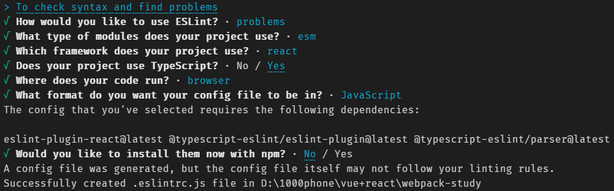

# webpack-init

#### webpack 入门介绍

webpack 基于 react、ts、js、less、css、html 打包并进行 eslint 代码规范以及 git hook 的 commit 检测

## eslint 格式化配置

1.  npm init -y
2.  npm install eslint --save-dev
3.  npm init @eslint/config



4. 创建.eslintignore 文件内部添加 node_modules 和.eslintrc.js

5. TS 集成

    npm install typescript -D

    npx tsc --init

6. 创建./src/demo.ts

7. 集成 eslint-plugin-react

    npm install eslint-plugin-react@latest --save-dev

8. 集成@typescript-eslint/eslint-plugin npm install @typescript-eslint/eslint-plugin@latest --save-dev

9. 集成 prettier npm install --save-dev --save-exact prettier

10. 创建.prettierrc.json echo {}> .prettierrc.json 指令不行就手动创建

```json
{
    "trailingComma": "es5",
    "tabWidth": 4,
    "semi": true,
    "singleQuote": true
}
```

11. 集成 eslint-config-prettier npm install --save-dev eslint-config-prettier

```json
{
    "extends": ["some-other-config-you-use", "prettier"]
}
```

12. 集成 git-hook husky

    npx husky-init

    npm install

pre-commit 文件

```sh
#!/bin/sh
. "$(dirname "$0")/_/husky.sh"
npm run eslint
```

### 其他问题

```json
 "rules": {
        "prettier/prettier": "error",
        "arrow-body-style": "off",
        "prefer-arrow-callback": "off",
        "@typescript-eslint/no-var-requires": 0
    }
/*
node_modules
.eslintrc.js
*.json*/
```

## webpack 打包

### husky

开发环境下的流程卡点
工作原理 git 生命周期 pre-commit 结合 npm 的生命周期 prepare

### webpack

```js
const path = require('path');

const webpack = require('webpack');

const config = {
    // mode: "production",
    entry: './src/index.js',
    output: {
        path: path.resolve(__dirname, './../dist'),
        filename: 'bundle.js',
    },
};

const obj = webpack(config);

obj.run(() => {
    console.log('工作完毕');
});
```

### 打包效率观测-插件-ProgressPlugin

```js
new webpack.ProgressPlugin({
    // activeModules: false, //显示活动模块计数和一个活动模块正在进行的消息
    entries: true, // 显示正在进行的入口文件计数消息。
    // handler(percentage, message, ...args) {
    //   // custom logic
    // }, // 可以自定义行为的函数
    modules: true, //显示正在进行的模块计数消息。
    // modulesCount: 5000, //开始时的最小模块数。modules启用属性时生效。
    // profile: false, //告诉ProgressPlugin为进度步骤收集配置文件数据。
    dependencies: true, //显示正在进行的依赖项计数消息。
    // dependenciesCount: 10000, //开始时的最小依赖项计数。dependencies启用属性时生效。
    // percentBy: null, //说明如何计算进度百分比。
});
```

### 打包产物观测 - 插件-webpack-bundle-analyzer

```js
const { BundleAnalyzerPlugin } = require('webpack-bundle-analyzer');

module.exports = {
    // ...others
    plugins: [
        // ...others
        new BundleAnalyzerPlugin({
            analyzerHost: '127.0.0.1', // 默认这个127.0.0.1
            analyzerPort: 8888, // 默认8888
            // others https://github.com/webpack-contrib/webpack-bundle-analyzer
        }),
    ],
};
```

### 生产环境-mode-production-追求更小更轻量的 bundle

-   丑化压缩！ - production 内置功能
-   小图片转 base64 - webpack4:url-loader file-loader webpack5 功能内置-asset/resource

```js
      {
        test: /\.(png|svg|jpg|jpeg|gif)$/i,
        type: 'asset/resource',
      },

```

-   css 是否抽离出来-MiniCssExtractPlugin

-   css 优化压缩

```js
const MiniCssExtractPlugin = require('mini-css-extract-plugin');
const CssMinimizerPlugin = require('css-minimizer-webpack-plugin');

module.exports = {
    module: {
        rules: [
            {
                test: /.s?css$/,
                use: [MiniCssExtractPlugin.loader, 'css-loader', 'sass-loader'],
            },
        ],
    },
    optimization: {
        minimizer: [
            // 在 webpack@5 中，你可以使用 `...` 语法来扩展现有的 minimizer（即 `terser-webpack-plugin`），将下一行取消注释
            // `...`,
            new CssMinimizerPlugin(),
        ],
    },
    plugins: [new MiniCssExtractPlugin()],
};
```

### 开发环境-mode-development 追求高效便利快捷的开发体验

-   sourcemap
    -   https://webpack.docschina.org/configuration/devtool
-   devserver
    -   代理跨域 proxy

```shell
# webpack server
```

```js

  // npm install --save-dev webpack-dev-server
  devServer: {
    static: './dist',
    proxy: {
      '/api': {
        target: 'http://localhost:3000', // 代理源
        pathRewrite: {'^/api' : ''}, // url 重写
      }
    },
    // hot: true, // 热更新 webpack5粒默认已经配置好了
  },
  /**
 * @typedef {Object} Configuration
 * @property {boolean | string} [ipc]
 * @property {Host} [host]
 * @property {Port} [port]
 * @property {boolean | "only"} [hot]
 * @property {boolean} [liveReload]
 * @property {DevMiddlewareOptions<Request, Response>} [devMiddleware]
 * @property {boolean} [compress]
 * @property {boolean} [magicHtml]
 * @property {"auto" | "all" | string | string[]} [allowedHosts]
 * @property {boolean | ConnectHistoryApiFallbackOptions} [historyApiFallback]
 * @property {boolean} [setupExitSignals]
 * @property {boolean | BonjourOptions} [bonjour]
 * @property {string | string[] | WatchFiles | Array<string | WatchFiles>} [watchFiles]
 * @property {boolean | string | Static | Array<string | Static>} [static]
 * @property {boolean | ServerOptions} [https]
 * @property {boolean} [http2]
 * @property {"http" | "https" | "spdy" | string | ServerConfiguration} [server]
 * @property {boolean | "sockjs" | "ws" | string | WebSocketServerConfiguration} [webSocketServer]
 * @property {ProxyConfigMap | ProxyConfigArrayItem | ProxyConfigArray} [proxy]
 * @property {boolean | string | Open | Array<string | Open>} [open]
 * @property {boolean} [setupExitSignals]
 * @property {boolean | ClientConfiguration} [client]
 * @property {Headers | ((req: Request, res: Response, context: DevMiddlewareContext<Request, Response>) => Headers)} [headers]
 * @property {(devServer: Server) => void} [onAfterSetupMiddleware]
 * @property {(devServer: Server) => void} [onBeforeSetupMiddleware]
 * @property {(devServer: Server) => void} [onListening]
 * @property {(middlewares: Middleware[], devServer: Server) => Middleware[]} [setupMiddlewares]
 */
```

### 完全自定义环境-mode-none 不建议开启

我们写的配置和 mode 的默认配置会 merge。
mode 设为 none,就默认真的无配置了。

### 插件使用（[直接看文档](https://webpack.docschina.org/concepts/)）

## webpack 打包拆解

### webpack.commont.js

```js
const path = require('path');

const HtmlPlugin = require('html-webpack-plugin');

const { ProgressPlugin } = require('webpack');

// html模板打入
const htmlPlugin = new HtmlPlugin({
    template: './public/index.html',
});

// webpack打包观测
const processPlugin = new ProgressPlugin({
    // activeModules: false, //显示活动模块计数和一个活动模块正在进行的消息
    entries: true, // 显示正在进行的入口文件计数消息。
    // handler(percentage, message, ...args) {
    //   // custom logic
    // }, // 可以自定义行为的函数
    modules: true, //显示正在进行的模块计数消息。
    // modulesCount: 5000, //开始时的最小模块数。modules启用属性时生效。
    // profile: false, //告诉ProgressPlugin为进度步骤收集配置文件数据。
    dependencies: true, //显示正在进行的依赖项计数消息。
    // dependenciesCount: 10000, //开始时的最小依赖项计数。dependencies启用属性时生效。
    // percentBy: null, //说明如何计算进度百分比。
});

module.exports = {
    entry: './src/index.js',
    output: {
        filename: 'main.js',
        path: path.resolve(__dirname, 'dist'),
        clean: true,
    },
    module: {
        rules: [
            {
                test: /(\.css)$/,
                use: ['style-loader', 'css-loader'],
            },
            {
                test: /(\.less)$/,
                use: ['style-loader', 'css-loader', 'less-loader'],
            },
        ],
    },
    plugins: [htmlPlugin, processPlugin],
};
```

### weboack.dev.js

```js
const { merge } = require('webpack-merge');
const commonConfig = require('./webpack.common');
module.exports = merge(commonConfig, {
    mode: 'development',
    devtool: 'source-map',
    devServer: {
        proxy: {
            '/api': {
                target: 'http://localhost:3333',
            },
        },
    },
});
```

### webpack.pro.js

```js
const { merge } = require('webpack-merge');
const commonConfig = require('./webpack.common');
const { BundleAnalyzerPlugin } = require('webpack-bundle-analyzer');
const bundleObserver = new BundleAnalyzerPlugin({});
module.exports = merge(commonConfig, {
    mode: 'production',
    plugins: [bundleObserver],
});
```

### 最终配置

#### eslintrc

```js
module.exports = {
    env: {
        browser: true,
        es2021: true,
        node: true,
    },
    extends: [
        'eslint:recommended',
        'plugin:react/recommended',
        'plugin:@typescript-eslint/recommended',
        'plugin:prettier/recommended',
    ],
    parser: '@typescript-eslint/parser',
    parserOptions: {
        ecmaFeatures: {
            jsx: true,
        },
        ecmaVersion: 'latest',
        sourceType: 'module',
    },
    plugins: ['react', '@typescript-eslint', 'prettier'],
    rules: {
        '@typescript-eslint/no-var-requires': 0,
        'prettier/prettier': 'error',
        'arrow-body-style': 'off',
        'prefer-arrow-callback': 'off',
    },
    settings: {
        react: {
            version: '17.0.2',
        },
    },
};
```

### tsconfig.json

```json
{
    "compilerOptions": {
        "target": "es2016",
        "jsx": "react",
        "module": "commonjs",
        // "allowJs": true,
        // "sourceMap": true,
        "noEmit": true,
        "esModuleInterop": true,
        "forceConsistentCasingInFileNames": true,
        "strict": true,
        "skipLibCheck": true
    }
}
```

### package.json

```json
{
    "name": "@melody-core/webpack-study",
    "version": "1.0.0",
    "description": "",
    "main": ".eslintrc.js",
    "devDependencies": {
        "@typescript-eslint/eslint-plugin": "^5.12.1",
        "@typescript-eslint/parser": "^5.12.1",
        "css-loader": "^6.6.0",
        "eslint": "^8.9.0",
        "eslint-config-prettier": "^8.4.0",
        "eslint-plugin-prettier": "^4.0.0",
        "eslint-plugin-react": "^7.28.0",
        "html-webpack-plugin": "^5.5.0",
        "husky": "^7.0.0",
        "less": "^4.1.2",
        "less-loader": "^10.2.0",
        "prettier": "^2.5.1",
        "style-loader": "^3.3.1",
        "typescript": "^4.5.5",
        "webpack": "^5.69.1",
        "webpack-bundle-analyzer": "^4.5.0",
        "webpack-cli": "^4.9.2",
        "webpack-dev-server": "^4.7.4",
        "webpack-merge": "^5.8.0"
    },
    "scripts": {
        "test": "echo \"Error: no test specified\" && exit 1",
        "eslint": "eslint ./src/**",
        "eslint-fix": "eslint  ./src/** --fix",
        "prepare": "husky install",
        "dev": "webpack server -c ./webpack.dev.js",
        "build": "webpack  -c ./webpack.pro.js"
    },
    "repository": {
        "type": "git",
        "url": "https://gitee.com/melody-lx/webpack-study-gp27.git"
    },
    "keywords": [],
    "author": "",
    "license": "ISC",
    "dependencies": {
        "react": "^17.0.2"
    }
}
```

## webpack 插件

### 打包效率观测-插件-ProgressPlugin

```js
new webpack.ProgressPlugin({
    // activeModules: false, //显示活动模块计数和一个活动模块正在进行的消息
    entries: true, // 显示正在进行的入口文件计数消息。
    // handler(percentage, message, ...args) {
    //   // custom logic
    // }, // 可以自定义行为的函数
    modules: true, //显示正在进行的模块计数消息。
    // modulesCount: 5000, //开始时的最小模块数。modules启用属性时生效。
    // profile: false, //告诉ProgressPlugin为进度步骤收集配置文件数据。
    dependencies: true, //显示正在进行的依赖项计数消息。
    // dependenciesCount: 10000, //开始时的最小依赖项计数。dependencies启用属性时生效。
    // percentBy: null, //说明如何计算进度百分比。
});
```

### 打包产物观测 - 插件-webpack-bundle-analyzer

```js
const { BundleAnalyzerPlugin } = require('webpack-bundle-analyzer');

module.exports = {
    // ...others
    plugins: [
        // ...others
        new BundleAnalyzerPlugin({
            analyzerHost: '127.0.0.1', // 默认这个127.0.0.1
            analyzerPort: 8888, // 默认8888
            // others https://github.com/webpack-contrib/webpack-bundle-analyzer
        }),
    ],
};
```

### 生产环境-mode-production-追求更小更轻量的 bundle

-   丑化压缩！ - production 内置功能
-   小图片转 base64 - webpack4:url-loader file-loader webpack5 功能内置-asset/resource

```js
      {
        test: /\.(png|svg|jpg|jpeg|gif)$/i,
        type: 'asset/resource',
      },

```

-   css 是否抽离出来-MiniCssExtractPlugin

-   css 优化压缩

```js
const MiniCssExtractPlugin = require('mini-css-extract-plugin');
const CssMinimizerPlugin = require('css-minimizer-webpack-plugin');

module.exports = {
    module: {
        rules: [
            {
                test: /.s?css$/,
                use: [MiniCssExtractPlugin.loader, 'css-loader', 'sass-loader'],
            },
        ],
    },
    optimization: {
        minimizer: [
            // 在 webpack@5 中，你可以使用 `...` 语法来扩展现有的 minimizer（即 `terser-webpack-plugin`），将下一行取消注释
            // `...`,
            new CssMinimizerPlugin(),
        ],
    },
    plugins: [new MiniCssExtractPlugin()],
};
```

### 开发环境-mode-development 追求高效便利快捷的开发体验

-   sourcemap
    -   https://webpack.docschina.org/configuration/devtool
-   devserver
    -   代理跨域 proxy

```shell
# webpack server
```

```js

  // npm install --save-dev webpack-dev-server
  devServer: {
    static: './dist',
    proxy: {
      '/api': {
        target: 'http://localhost:3000', // 代理源
        pathRewrite: {'^/api' : ''}, // url 重写
      }
    },
    // hot: true, // 热更新 webpack5粒默认已经配置好了
  },
  /**
 * @typedef {Object} Configuration
 * @property {boolean | string} [ipc]
 * @property {Host} [host]
 * @property {Port} [port]
 * @property {boolean | "only"} [hot]
 * @property {boolean} [liveReload]
 * @property {DevMiddlewareOptions<Request, Response>} [devMiddleware]
 * @property {boolean} [compress]
 * @property {boolean} [magicHtml]
 * @property {"auto" | "all" | string | string[]} [allowedHosts]
 * @property {boolean | ConnectHistoryApiFallbackOptions} [historyApiFallback]
 * @property {boolean} [setupExitSignals]
 * @property {boolean | BonjourOptions} [bonjour]
 * @property {string | string[] | WatchFiles | Array<string | WatchFiles>} [watchFiles]
 * @property {boolean | string | Static | Array<string | Static>} [static]
 * @property {boolean | ServerOptions} [https]
 * @property {boolean} [http2]
 * @property {"http" | "https" | "spdy" | string | ServerConfiguration} [server]
 * @property {boolean | "sockjs" | "ws" | string | WebSocketServerConfiguration} [webSocketServer]
 * @property {ProxyConfigMap | ProxyConfigArrayItem | ProxyConfigArray} [proxy]
 * @property {boolean | string | Open | Array<string | Open>} [open]
 * @property {boolean} [setupExitSignals]
 * @property {boolean | ClientConfiguration} [client]
 * @property {Headers | ((req: Request, res: Response, context: DevMiddlewareContext<Request, Response>) => Headers)} [headers]
 * @property {(devServer: Server) => void} [onAfterSetupMiddleware]
 * @property {(devServer: Server) => void} [onBeforeSetupMiddleware]
 * @property {(devServer: Server) => void} [onListening]
 * @property {(middlewares: Middleware[], devServer: Server) => Middleware[]} [setupMiddlewares]
 */
```

### 完全自定义环境-mode-none 不建议开启

我们写的配置和 mode 的默认配置会 merge。
mode 设为 none,就默认真的无配置了。

### 路径别名

```js
// webpack.config.js
{
  resolve: {
    alias: {
      "@" : path.resolve(__dirnmae, './src')
    }
  }
}

// ts
"baseUrl": "./",
"paths": {
    "@/*" : ["src/*"]
},

// eslint
"import/resolver": {
    "alias": [
        ["@", "./src"]
    ]
}

//模块声明-declare module

```

### babel && jsx

```js
// babel
{
  test: /(\.m?js)$/,
  exclude: /(node_modules|bower_components)/,
  use: {
    loader: 'babel-loader',
    // options的配置可以用.babelrc替代
    options: {
      presets: ['@babel/preset-env']
    }
  }
}

// 支持jsx
// 安装babel插件-@babel/preset-react
presets: ['@babel/react, @babel/preset-env']

// 支持ts - tsloader
```

## webpack 打包性能优化

### 代码分割

基于业务分割点进行 bundle 的抽离分割，需要对应处理 webpack 的入口和出口字段。

```js
    entry: {
        // key值等同于output里的[name]
        app:  "./src/index.tsx",
        pageOthers: "./src/pages/Fenlei/index.tsx"
    },
    output: {
        path: path.resolve(__dirname, './../dist'),
        // []内可以写webpack提供的命名规则表达式。
        filename: 'bundle-[name]-[hash:8].js',
        clean: true,
    },
```

### 共享模块抽离-dependOn

对于多个 bundle 都依赖的模块，也就是它们的共享模块，我们可以单独抽离出来,然后使用 dependOn 指定即可。
基于多 bundle 共享依赖的分割。

```js
    entry: {
        app: {
            import: "./src/index.tsx",
            dependOn: "lodashBundle"
        },
        pageOthers: {
            import: "./src/pages/Fenlei/index.tsx",
            dependOn: "lodashBundle"
        },
        lodashBundle: ['lodash'],
    },
```

### SplitChunksPlugin

最初，chunks（以及内部导入的模块）是通过内部 webpack 图谱中的父子关系关联的。CommonsChunkPlugin 曾被用来避免他们之间的重复依赖，但是不可能再做进一步的优化。

从 webpack v4 开始，移除了 CommonsChunkPlugin，取而代之的是 optimization.splitChunks。

开箱即用的 SplitChunksPlugin 对于大部分用户来说非常友好。
例如 splitChunks.mergeDuplicateChunks 默认为 true，表达合并公用模块。

### 默认配置情况下

启用 splitChunks 时，webpack 默认将根据以下条件自动拆分 chunks：

-   新的 chunk 可以被共享，或者模块来自于 node_modules 文件夹
-   新的 chunk 体积大于 20kb（在进行 min+gz 之前的体积）
-   当按需加载 chunks 时，并行请求的最大数量小于或等于 30
-   当加载初始化页面时，并发请求的最大数量小于或等于 30
-   当尝试满足最后两个条件时，最好使用较大的 chunks。

```js
    entry: {
        // key值等同于output里的[name]
        app:  "./src/index.tsx",
        pageOthers: "./src/pages/Fenlei/index.tsx"
    },
    optimization: {
        splitChunks: {
            chunks: 'all',
        },
```

### 动态导入-import()

当 Webpack 遇到这种语法时，它会自动开始对您的应用进行代码拆分。

<!-- **注意！！！** -->
<!-- 当webpack中使用了babel，一定要使用@babel/plugin-syntax-dynamic-import来告诉babel不要把动态导入的模块给直接导进去了。 -->

**注意！！！**
当我们使用了 ts，一定要在 tsconfig 里配置以下几项！

通过“告诉”typescript 编译器避开我们的 import 语句，并且不要对它们进行转码来让 Webpack 正常工作。

```js
  "module": "esnext",     //esnext 支持动态导入的新特性
  "moduleResolution": "node",     // 识别路径。
```

### 懒加载

基于业务逻辑，思考在合适的时机使用动态导入来实现懒加载的能力。
